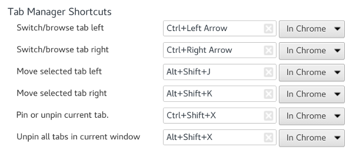

#  Chrome Tab Manager

> Manage your Chrome tabs with keyboard shortcuts.

## Install

- [Chrome Webstore](https://chrome.google.com/webstore/detail/oofoadncochbkbpebpbndghocapamchi)

## License

MIT © [Daniel Pham](https://danhp.github.io)

## Changelog

2.0.0
- Added active/select browsing tab functionality
- Removed default key suggestions so that [this](https://bugs.chromium.org/p/chromium/issues/detail?id=167419) bug is not hit now or in the future
- Updated API usage to query() from getSelected() since this has been deprecated since Chrome 33

1.0.0
- Initial Release
